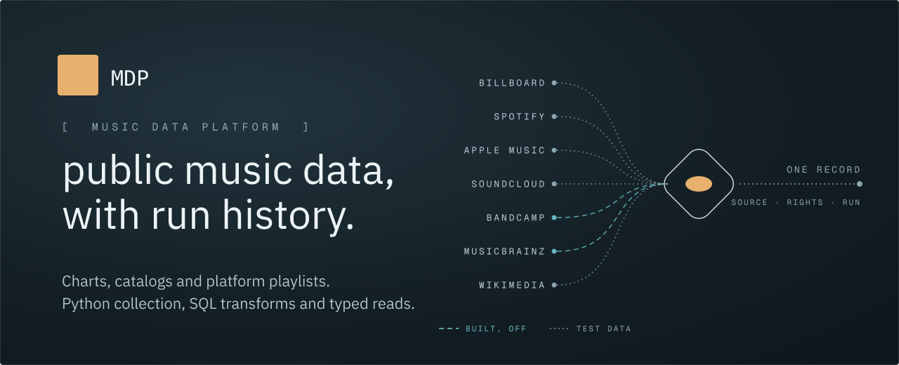
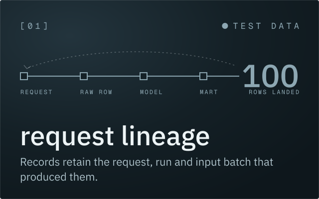
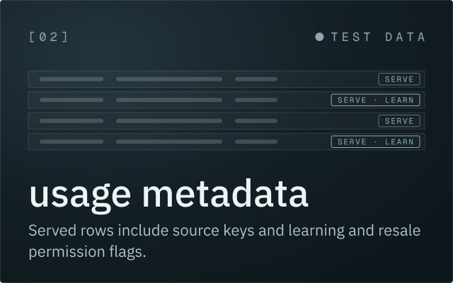
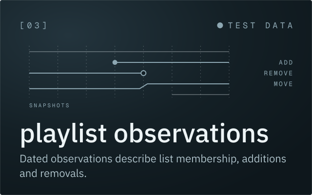
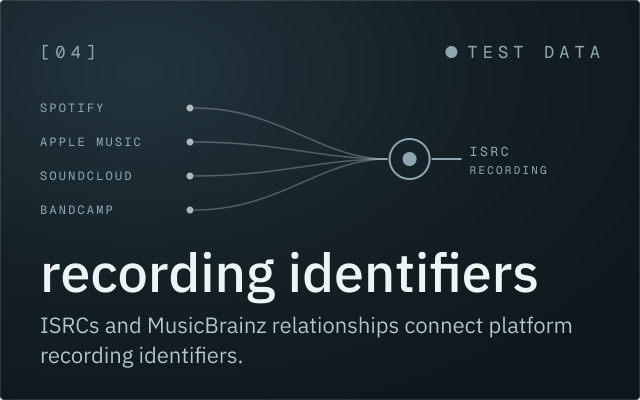

# Music Data Platform



A Python, SQL, TypeScript and R system for collecting public music data, matching recording identities, and serving typed tables.

Public charts and catalogs supply observations from MusicBrainz, ListenBrainz, Billboard, Shazam, KEXP, Wikimedia, and Wikidata. Platform playlists come from Spotify, Apple Music, Bandcamp, and SoundCloud. Most collectors ship disabled; the [source catalog](docs/sources.md) records availability and access methods.

Python functions fetch and validate records. dbt models join observations and compute playlist changes and song movement. A control API manages jobs, budgets, retries, and scoped targets; a data API serves declared mart contracts.

| Capability | Behavior |
|---|---|
| Request lineage | Stored records identify the request, run, and input batch that produced them. |
| Usage metadata | Served rows carry contributing source keys and ML-training and resale flags. Unknown permissions remain false. |
| Recording identity | Platform identifiers and ISRCs link observations to MusicBrainz recordings, with ambiguous matches retained for review. |
| Reproducible runs | Each run is pinned to a numbered checkpoint, and retries resume the same inputs and work. |
| Scoped execution | Global is the default scope. Tenant ids and scoped keys isolate work for one tenant. |






Read the [purpose](docs/vision.md). Start with the [glossary](docs/glossary.md), [architecture](docs/architecture.md), and [developer guide](docs/DEVELOPING.md). The [operations guide](docs/operating.md) covers local and deployed execution. This is a working snapshot with synthetic fixtures and no hosted instance; running collectors requires your own configuration and applicable access permissions.

## Run it locally

Install Docker, uv (Python 3.12), Node 22, pnpm 10.28.0, tmux, psql and curl. Start Docker, then run from the clone:

```sh
bash ops/local/up.sh
```

This loads a synthetic week and prints the console, data API and Postgres URLs. Local database roles use disposable role-name passwords on loopback. Stop the stack with `bash ops/local/down.sh`. See [Quickstart](docs/DEVELOPING.md#quickstart) for cleanup and troubleshooting.

Check each provider’s terms before enabling a collector.

All rights reserved. The source is public to read.
